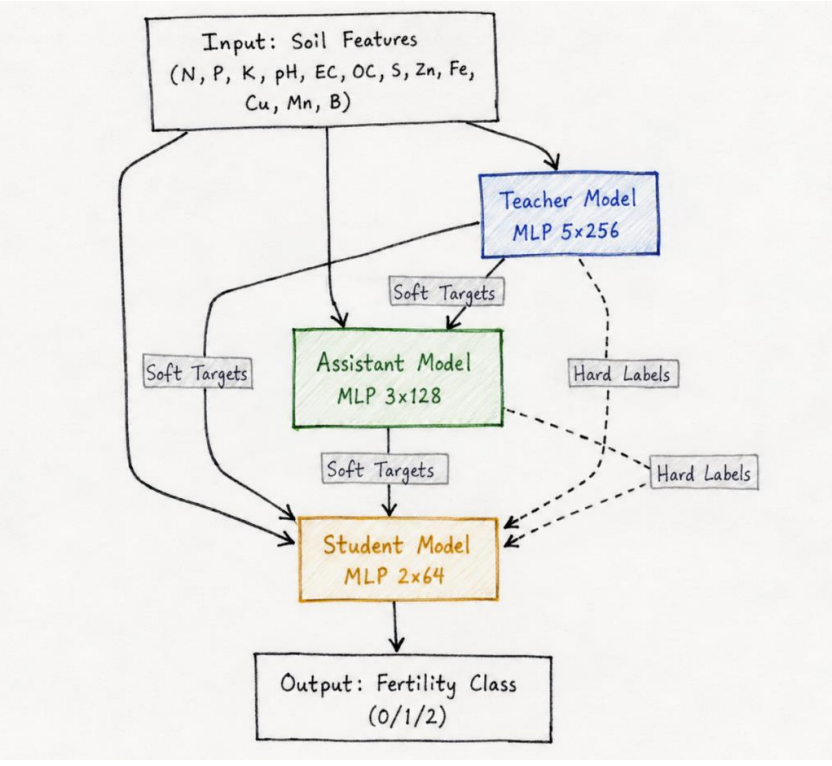

# FertilNet

Hierarchical Knowledge Distillation Framework for Lightweight Real-Time Soil Fertility Prediction

## Architecture

Teacher MLP (5 × 256)
        ↓
Assistant MLP (3 × 128)
        ↓
Student MLP (2 × 64)



## 🚀 Project Highlights

- 🎯 90.91% Test Accuracy
- ⚡ 51× Smaller Model than Teacher Network
- 🧠 Hierarchical Knowledge Distillation (Teacher → Assistant → Student)
- 🌱 Real-Time Soil Fertility Prediction
- 📦 ONNX Export for Edge Deployment
- 🐍 Built with PyTorch, Scikit-Learn, and XGBoost

## Overview

FertilNet is a machine learning framework that predicts soil fertility using physicochemical soil attributes while remaining lightweight enough for deployment on resource-constrained devices.

The project introduces a Teacher–Assistant–Student (TAS) knowledge distillation pipeline that compresses a large neural network into a compact model suitable for real-time inference.

## Why FertilNet?

Traditional soil fertility testing is often expensive, time-consuming, and inaccessible to smallholder farmers. While machine learning models can improve prediction accuracy, many high-performing models are too computationally intensive for deployment on low-power devices.

FertilNet addresses this challenge through a Hierarchical Knowledge Distillation framework that compresses a large neural network into a lightweight student model. By leveraging a Teacher–Assistant–Student (TAS) architecture, FertilNet achieves high prediction accuracy while remaining suitable for real-time inference and edge deployment.

This makes the framework a promising solution for precision agriculture applications in resource-constrained environments.

## Features

- Soil fertility prediction
- Hierarchical Knowledge Distillation
- Teacher–Assistant–Student architecture
- ONNX model export
- Edge AI deployment support
- Random Forest baseline comparison
- Model compression for real-time inference

## Dataset Features

The model uses 12 soil attributes:

- Nitrogen (N)
- Phosphorus (P)
- Potassium (K)
- pH
- Electrical Conductivity (EC)
- Organic Carbon (OC)
- Sulfur (S)
- Zinc (Zn)
- Iron (Fe)
- Copper (Cu)
- Manganese (Mn)
- Boron (B)

## Technologies

- Python
- PyTorch
- Scikit-Learn
- XGBoost
- ONNX
- NumPy
- Pandas
- Matplotlib

## Results

| Model | Accuracy |
|---------|---------|
| Teacher MLP | 87.50% |
| Student (HierKD) | 90.91% |
| Random Forest | 90.23% |

### Key Achievements

- Achieved 90.91% test accuracy using Hierarchical Knowledge Distillation.
- Reduced model size by approximately 51× compared to the teacher network.
- Exported the lightweight student model to ONNX for edge deployment.
- Enabled real-time inference suitable for resource-constrained devices.


The distilled student model achieved higher accuracy than the teacher while using approximately 51× fewer parameters.

## Project Structure

```text
FertilNet/
│
├── data/
│   └── soil_data.csv
│
├── images/
│
├── outputs/
│
├── main.py
├── requirements.txt
├── README.md
└── .gitignore
```

## Installation

```bash
git clone https://github.com/ButtySaylee/FertilNet.git

cd FertilNet

pip install -r requirements.txt
```

## Run

```bash
python main.py
```

## Author

Butty Saylee

BTech Software Engineering  
Delhi Technological University

## License

MIT License